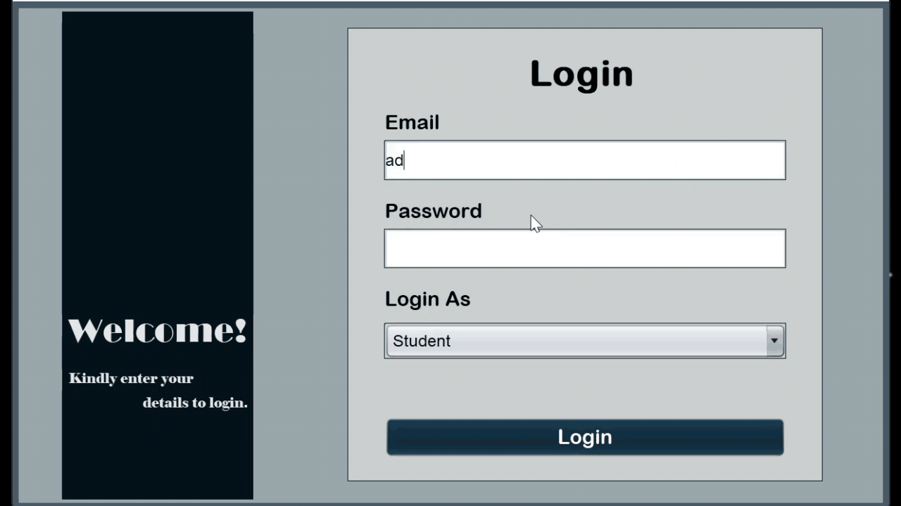
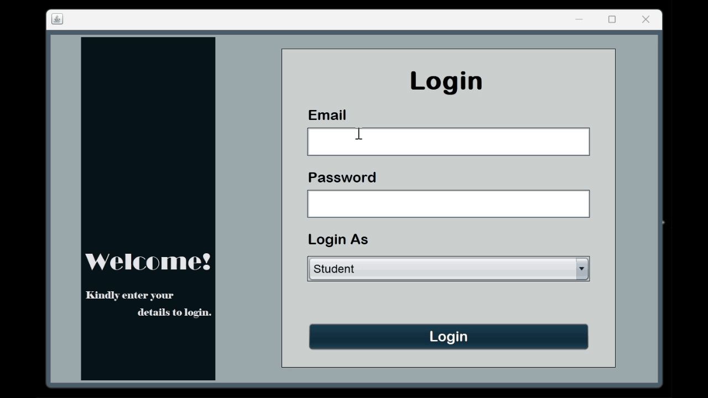
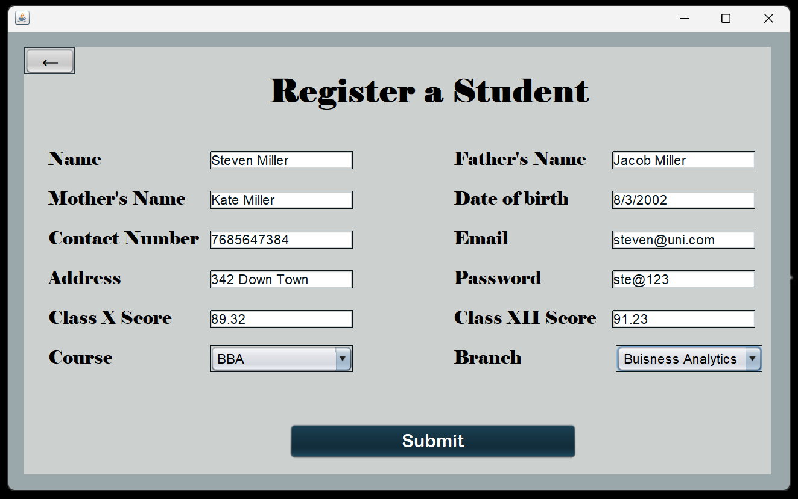

# 🎓 University Management System

The **University Management System** is a comprehensive platform designed to streamline and automate various academic and administrative processes within a university.

Developed using **Java (NetBeans)** and integrated with **XAMPP's MyPHPAdmin** for database management and **SQL** for backend operations, the system provides **role-based access** with distinct portals for:

- 🧑‍💼 **Administrator**
- 👨‍🏫 **Faculty**
- 👨‍🎓 **Students**

---

## 🔐 Authentication System

A robust login system that ensures secure access for each role.

- ✅ Validates input fields
  - If email or password fields are empty, it prompts:  
    **`"Email and Password are required"`**
- ❌ If credentials are incorrect, it alerts:  
  **`"Invalid Credentials"`**

---

## 🛠️ Admin Features

### 📋 Faculty & Student Registration

- Admin can **register faculty members** through a user-friendly form.
 
- 🖼 Students can be registered in a similar way.

### 🧾 Manage Records

- 🔄 Update existing **faculty and student information**
- 📤 **Approve or Disapprove** faculty leave applications
- 💰 **Calculate salary** for faculty members

---

## 👨‍🏫 Faculty Features

- 📝 **Apply for leave** and track status:
  - `Under Review`, `Approved`, or `Disapproved`
- 💵 **View salary details**
- ✅ **Approve/Disapprove leave requests** submitted by students
- 🧮 **Set student results**
  - Includes a **search function by roll number**

🎥 _[Video 4: Faculty Functionalities]_

---

## 👨‍🎓 Student Features

- 📝 **Apply for leave**
  - Track status updates (Approved/Disapproved/Under Review)
- 📊 **View academic results**

🎥 _[Video 5: Student Functionalities]_

---

## 📁 Tech Stack

| Layer            | Technology                |
|------------------|---------------------------|
| Frontend         | Java Swing (GUI in NetBeans) |
| Backend          | Java                      |
| Database         | MySQL via XAMPP (phpMyAdmin) |
| Tool Used        | NetBeans IDE              |

---

## Setup Instructions
To set up this project locally, follow these steps:
1. Install **XAMPP** for database management and start **MySQL** services.
2. Import the SQL database included in the repository into **MyPHPAdmin**.
3. Open the project in **NetBeans** and configure the database connection.
4. Run the project from NetBeans and access it through your preferred web browser.
